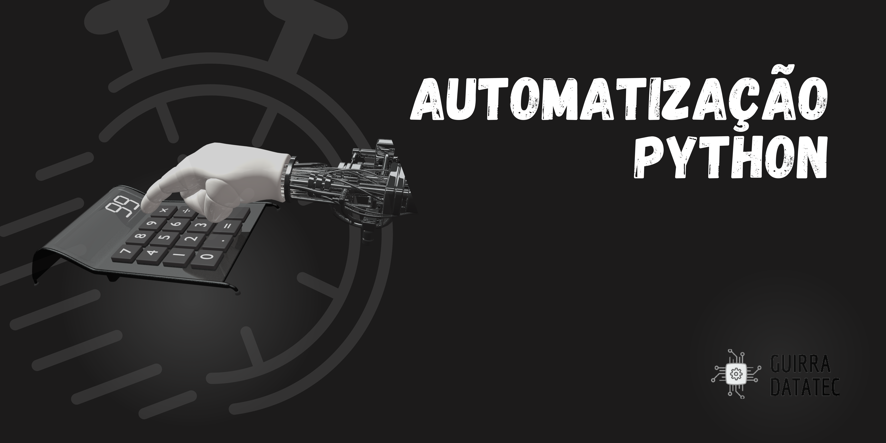

# Automação com a linguagem Python
  

  

---

Esse repositório tem por objetivo guardar meus projetos em automação com a linguagem de programação **Python**. Aqui serão criadas diversas aplicações, com diferentes bibliotecas, em python com a finalidade de mostrar a possibilidade de criação com essa linguagem de programação.

Já imaginou automatizar diversas tarefas no dia a dia, mandar um email para seu chefe com todas as análises feitas, isso tudo com a execução da sua máquina? Pois é, isso é possível, e aqui se encontram algumas das diversas aplicações que pode se fazer com automação, e com a linguagem Python.

Espero que goste e se divirta.

 
---
